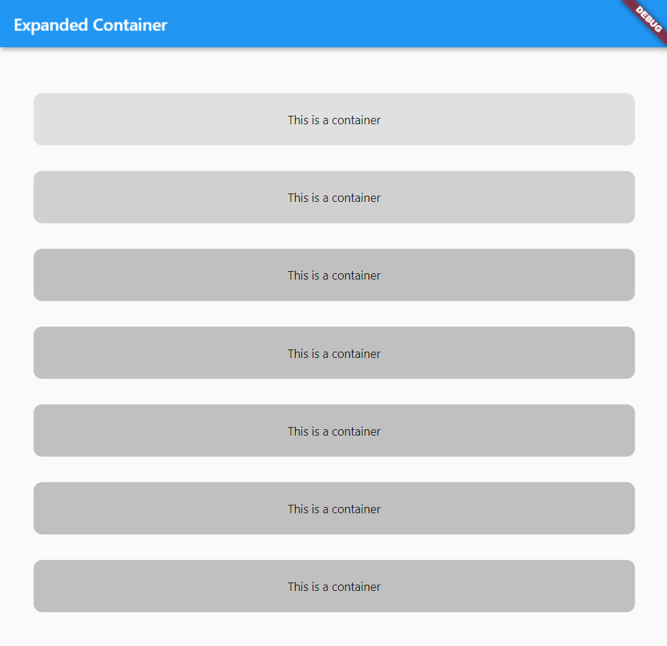

# columns

## contents

- [columns](#columns)
  - [contents](#contents)
  - [introduction](#introduction)
  - [column-04](#column-04)
  - [cross axis alignment](#cross-axis-alignment)

## introduction

this page looks at how to create and manage columns in flutter

## column-04

Please see [Columns-04](../projects/column04) for an example of how to build a simple column interface

  

## cross axis alignment

here we see a vertical column with cross axis alignment centering the column horizontally

```java
import 'package:flutter/material.dart';

void main() {
  runApp(myApp());
}

class myApp extends StatelessWidget {
  const myApp({Key? key}) : super(key: key);

  @override
  Widget build(BuildContext context) {
    return MaterialApp(
      home: Scaffold(
        backgroundColor: Colors.teal.shade300,
        appBar: AppBar(
          backgroundColor: Colors.teal.shade600,
        ),
        body: SafeArea(
          child: Column(
              mainAxisSize: MainAxisSize.max,
              mainAxisAlignment: MainAxisAlignment.center,
              verticalDirection: VerticalDirection.up,
              crossAxisAlignment: CrossAxisAlignment.end,
              children: <Widget>[
                Container(
                  margin:
                      const EdgeInsets.symmetric(vertical: 20, horizontal: 50),
                  padding: const EdgeInsets.all(20),
                  width: 300,
                  height: 100,
                  decoration: BoxDecoration(
                    border: Border.all(color: Colors.blueAccent),
                    color: Colors.red,
                  ),
                  child: Text(
                    'box 1',
                    textAlign: TextAlign.center,
                    style: TextStyle(
                      backgroundColor: Colors.green.shade300,
                      color: Colors.blueGrey.shade900,
                      fontSize: 40,
                    ),
                  ),
                ),
                Container(
                  margin:
                      const EdgeInsets.symmetric(vertical: 20, horizontal: 50),
                  padding: const EdgeInsets.all(20),
                  width: 300,
                  height: 100,
                  decoration: BoxDecoration(
                    border: Border.all(color: Colors.blueAccent),
                    color: Colors.red,
                  ),
                  child: Text(
                    'box 2',
                    textAlign: TextAlign.center,
                    style: TextStyle(
                      backgroundColor: Colors.green.shade300,
                      color: Colors.blueGrey.shade900,
                      fontSize: 40,
                    ),
                  ),
                ),
                Container(
                  margin:
                      const EdgeInsets.symmetric(vertical: 20, horizontal: 50),
                  padding: const EdgeInsets.all(20),
                  width: 300,
                  height: 100,
                  decoration: BoxDecoration(
                    border: Border.all(color: Colors.blueAccent),
                    color: Colors.red,
                  ),
                  child: Text(
                    'box 3',
                    textAlign: TextAlign.center,
                    style: TextStyle(
                      backgroundColor: Colors.green.shade300,
                      color: Colors.blueGrey.shade900,
                      fontSize: 40,
                    ),
                  ),
                ),
                Container(
                  width: double.infinity,
                ),
              ]),
        ),
        floatingActionButton: FloatingActionButton(
          backgroundColor: Colors.teal.shade800,
          child: Icon(Icons.add),
          onPressed: () {},
        ),
      ),
    );
  }
}
```
