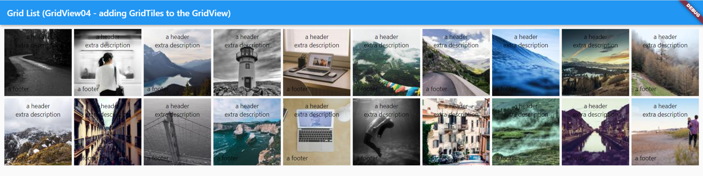
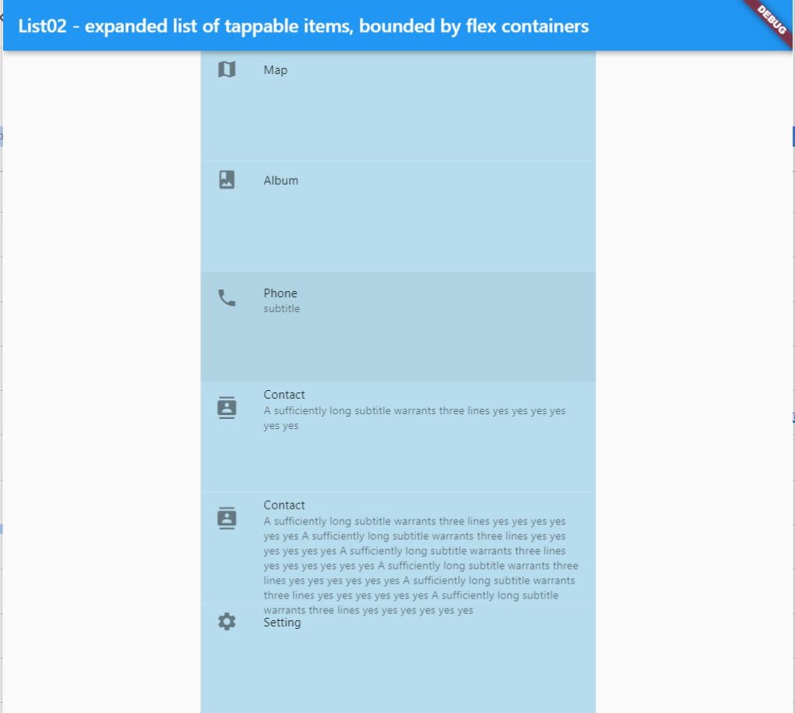
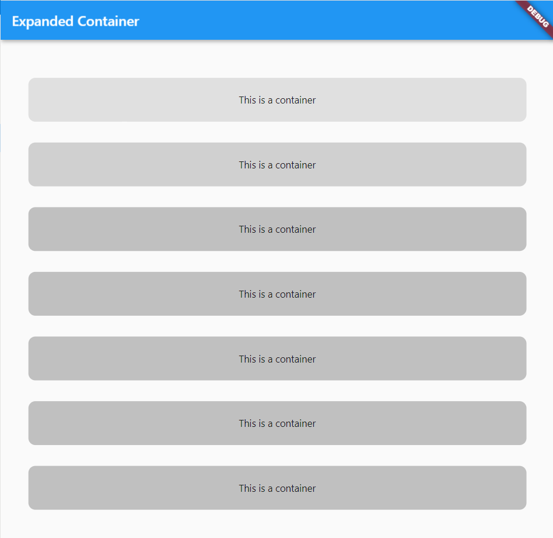

# containers and layout

## contents

- [containers and layout](#containers-and-layout)
  - [contents](#contents)
  - [introduction](#introduction)
  - [body](#body)
    - [body - single container](#body---single-container)
    - [body - center](#body---center)
    - [box](#box)
  - [box](#box-1)
  - [row](#row)
  - [column](#column)
  - [grid](#grid)
    - [gridtile01](#gridtile01)
    - [gridview01](#gridview01)
    - [gridview02](#gridview02)
    - [gridview03](#gridview03)
    - [gridview04](#gridview04)
  - [list](#list)
    - [list01](#list01)
    - [list02](#list02)
  - [stack](#stack)
    - [stack01](#stack01)
  - [sizedbox](#sizedbox)
    - [sized box as padding](#sized-box-as-padding)
  - [constrained box](#constrained-box)
  - [expanded](#expanded)
    - [expanded01](#expanded01)
    - [expanded02](#expanded02)
  - [flex](#flex)
    - [flex01](#flex01)
  - [flexible](#flexible)
  - [layout](#layout)
  - [single child layout widgets](#single-child-layout-widgets)
  - [multi child layout widgets](#multi-child-layout-widgets)
  - [safe area](#safe-area)
  - [clickable containers](#clickable-containers)
    - [inkwell](#inkwell)

## introduction

different kinds of containers
- materialapp
- body
- scaffold
- row
- column
- grid
- list
- stack
- expanded
- flexible
- flex

Container must have a parent which is
- Center
- Padding
- Column
- Row
- Scaffold

containers with no children will take up the maximum size
containers with children will take up the size of their children

## body

### body - single container

```java
class Home extends StatelessWidget {
  @override
  Widget build (BuildContext context) {
    return Scaffold(
      appBar: AppBar(
        title: Center(
          child: Text("Home Screen")),
      ),
      body: Container
        (
          child: Row(
            mainAxisAlignment: MainAxisAlignment.center,
            children: <Widget>[
              Text('some text'),
              Text('some more text').
            ],
          )
        ),
    );
  }
}
```

### body - center

*Note: container with a parent of Center by default will fill the screen*

```java
Widget build (BuildContext context) {
    return Scaffold(
      appBar: AppBar(
        title: Center(
          child: Text("Home Screen")),
      ),   
      body: Center(
        child:Container(
          color: Colors.green,
        ),
      ),
    );
  }
```

to center an item we can use several methods

- Center widget
- Container with alignment: Alignment.center
- Column with nainAxisAlignment: MainAxisAlignment.center
- Align with alignment: Alignment.center


### box

## box 

we can create a box as a container

```java
import 'package:flutter/material.dart';

void main() {
  runApp(myApp());
}

class myApp extends StatelessWidget {
  const myApp({Key? key}) : super(key: key);

  @override
  Widget build(BuildContext context) {
    return MaterialApp(
      home: Scaffold(
        backgroundColor: Colors.teal.shade300,
        appBar: AppBar(
          backgroundColor: Colors.teal.shade600,
        ),
        body: SafeArea(
          child: Container(
            margin: const EdgeInsets.all(20),
            padding: const EdgeInsets.all(20),
            width: 300,
            height: 300,
            decoration: BoxDecoration(
              border: Border.all(color: Colors.blueAccent),
            ),
            child: Text('an app',
                style: TextStyle(
                  backgroundColor: Colors.white,
                )),
          ),
        ),
        floatingActionButton: FloatingActionButton(
          backgroundColor: Colors.teal.shade800,
          child: Icon(Icons.add),
          onPressed: () {},
        ),
      ),
    );
  }
}
```

## row

[rows](row.md)

## column

[columns](column.md)


## grid 

see [GridView01](../projects/GridView01), [GridView02](../projects/GridView02), [GridView03](../projects/GridView03), [GridView04](../projects/GridView04) for `GridView` examples and also [GridView04](../projects/GridView04) for an example of using a `GridTile` in a `GridView` layout which can have a floating title and a floating footer above an image

```java
/// generates a grid of images of fixed size and adds in margin spacing between items.  This also adds in a [GridTile] to the [GridView]

import 'package:flutter/material.dart';

void main() {
  runApp(const MyApp());
}

/// [myApp] is Stateless and renders a [GridView] with an auto-generateed [List] - 
/// each item in the [GridView] comes from the [List] [index] and also a random [Image]
class MyApp extends StatelessWidget {
  const MyApp({Key? key}) : super(key: key);
  @override
  Widget build(BuildContext context) {
    const title = 'Grid List (GridView04 - adding GridTiles to the GridView)';

    return MaterialApp(
      title: title,
      home: Scaffold(
        appBar: AppBar(
          title: const Text(title),
        ),
        body: Container(
          margin: EdgeInsets.all(10),
          child: GridView.count(
            crossAxisCount: 10,
            mainAxisSpacing: 5,
            crossAxisSpacing: 5,
            children: List.generate(20, (index) {
              return Center(
                  child: GridTile(
                  header: Container(
                    padding: const EdgeInsets.all(8),
                    child: Column(
                      mainAxisAlignment: MainAxisAlignment.center,
                      children: <Widget>[
                        const Text('a header'),
                        const Text('extra description'),
                      ],
                    ),
                  ),
                  child: Image(
                    image: NetworkImage('https://picsum.photos/120?random=$index'),
                    fit: BoxFit.cover,
                  ),
                  footer: Container(
                    padding: const EdgeInsets.all(8),
                    child: Text('a footer'),
                  ),
                ),
              );
            }),
          ),
        ),
      ),
    );
  }
}
```

### gridtile01

this displays tiles in a grid

  

[gridtile01](../projects/GridTile01)

```java
/// generates a grid of images of fixed size and adds in margin spacing between items.  This also adds in a [GridTile] to the [GridView]

import 'package:flutter/material.dart';

void main() {
  runApp(const MyApp());
}

/// [myApp] is Stateless and renders a [GridView] with an auto-generateed [List] - 
/// each item in the [GridView] comes from the [List] [index] and also a random [Image]
class MyApp extends StatelessWidget {
  const MyApp({Key? key}) : super(key: key);
  @override
  Widget build(BuildContext context) {
    const title = 'GridTile01 with tiles in a grid';
    return MaterialApp(
      title: title,
      home: Scaffold(
        appBar: AppBar(
          title: const Text(title),
        ),
        body: Container(
          margin: EdgeInsets.all(10),
          child: GridView.count(
            crossAxisCount: 10,
            mainAxisSpacing: 5,
            crossAxisSpacing: 5,
            children: List.generate(20, (index) {
              return Center(
                  child: GridTile(
                  header: Container(
                    padding: const EdgeInsets.all(8),
                    child: Column(
                      mainAxisAlignment: MainAxisAlignment.center,
                      children: <Widget>[
                        const Text('a header'),
                        const Text('extra description'),
                      ],
                    ),
                  ),
                  child: Image(
                    image: NetworkImage('https://picsum.photos/120?random=$index'),
                    fit: BoxFit.cover,
                  ),
                  footer: Container(
                    padding: const EdgeInsets.all(8),
                    child: Text('a footer'),
                  ),
                ),
              );
            }),
          ),
        ),
      ),
    );
  }
}
```

### gridview01

a simple list displayed in a grid layout

  

[gridview01](../projects/GridView01)

```java
/// This generates a list of items on the screen automatically and displays the items using the list index number, in a grid on the screen

import 'package:flutter/material.dart';

void main() {
  runApp(const MyApp());
}

class MyApp extends StatelessWidget {
  const MyApp({Key? key}) : super(key: key);

  @override
  Widget build(BuildContext context) {
    const title = 'Grid List - auto-generated list, displayed as a grid';

    return MaterialApp(
      title: title,
      home: Scaffold(
        appBar: AppBar(
          title: const Text(title),
        ),
        body: GridView.count(
          crossAxisCount: 10,
          children: List.generate(20, (index) {
            return Center(
              child: Text(
                'Item $index',
                style: Theme.of(context).textTheme.bodyText1,
              ),
            );
          }),
        ),
      ),
    );
  }
}
```

### gridview02

this displays a list of images, displayed in a grid layout

  

[gridview02](../projects/GridView02)

```java
/// [GridView02] generates a grid of images of fixed size

import 'package:flutter/material.dart';

void main() {
  runApp(const MyApp());
}

/// [myApp] is Stateless and renders a [GridView] with an auto-generateed [List] - 
/// each item in the [GridView] comes from the [List] [index] and also a random [Image]
class MyApp extends StatelessWidget {
  const MyApp({Key? key}) : super(key: key);
  @override
  Widget build(BuildContext context) {
    const title = 'GridView02 - a list of images displayed in a grid layout';

    return MaterialApp(
      title: title,
      home: Scaffold(
        appBar: AppBar(
          title: const Text(title),
        ),
        body: GridView.count(
          crossAxisCount: 10,
          children: List.generate(20, (index) {
            return Center(
              child: Column(
                mainAxisAlignment: MainAxisAlignment.center,
                children: <Widget>[
                  Text(
                    'Item $index',
                    style: Theme.of(context).textTheme.bodyText1,
                  ),
                  Image(
                    image: NetworkImage('https://picsum.photos/120?random=$index'),
                  ),
                ]
              ),
            );
          }),
        ),
      ),
    );
  }
}
```

### gridview03

this displays a list of 20 images in a grid layout, with margins added

  

[gridview03](../projects/gridview03)

```java
/// [GridView03] generates a grid of images of fixed size and adds in margin spacing between items

import 'package:flutter/material.dart';

void main() {
  runApp(const MyApp());
}

/// [myApp] is Stateless and renders a [GridView] with an auto-generateed [List] - 
/// each item in the [GridView] comes from the [List] [index] and also a random [Image]
class MyApp extends StatelessWidget {
  const MyApp({Key? key}) : super(key: key);
  @override
  Widget build(BuildContext context) {
    const title = 'GridView03 - a list of images displayed as a grid with margins';

    return MaterialApp(
      title: title,
      home: Scaffold(
        appBar: AppBar(
          title: const Text(title),
        ),
        body: GridView.count(
          crossAxisCount: 10,
          mainAxisSpacing: 5,
          crossAxisSpacing: 5,
          children: List.generate(20, (index) {
            return Center(
              child: Column(
                mainAxisAlignment: MainAxisAlignment.center,
                children: <Widget>[
                  Text(
                    'Item $index',
                    style: Theme.of(context).textTheme.bodyText1,
                  ),
                  Image(
                    image: NetworkImage('https://picsum.photos/120?random=$index'),
                  ),
                ]
              ),
            );
          }),
        ),
      ),
    );
  }
}
```

### gridview04

  


[gridview04](../projects/GridView04)

```java
/// gridview04 - list of 20 tiles [GridTile] with image, heading, description and footer displayed in a [GridView]
import 'package:flutter/material.dart';
void main() {
  runApp(const MyApp());
}
/// [myApp] is Stateless and renders a [GridView] with an auto-generateed [List] - 
/// each item in the [GridView] comes from the [List] [index] and also a random [Image]
class MyApp extends StatelessWidget {
  const MyApp({Key? key}) : super(key: key);
  @override
  Widget build(BuildContext context) {
    const title = 'GridView04 - list of 20 tiles with image, heading, description and footer displayed in a gridview';
    return MaterialApp(
      title: title,
      home: Scaffold(
        appBar: AppBar(
          title: const Text(title),
        ),
        body: Container(
          margin: EdgeInsets.all(10),
          child: GridView.count(
            crossAxisCount: 10,
            mainAxisSpacing: 5,
            crossAxisSpacing: 5,
            children: List.generate(20, (index) {
              return Center(
                  child: GridTile(
                  header: Container(
                    padding: const EdgeInsets.all(8),
                    child: Column(
                      mainAxisAlignment: MainAxisAlignment.center,
                      children: <Widget>[
                        Text(
                          'header $index',
                        ),
                        const Text(
                          'description', 
                          style: TextStyle(
                            fontWeight: FontWeight.bold
                          ),
                        ),
                      ],
                    ),
                  ),
                  child: Image(
                    image: NetworkImage('https://picsum.photos/120?random=$index'),
                    fit: BoxFit.cover,
                  ),
                  footer: Container(
                    padding: const EdgeInsets.all(8),
                    child: Text(
                      'footer in bold', 
                      style: TextStyle(fontWeight: FontWeight.bold),
                    ),
                  ),
                ),
              );
            }),
          ),
        ),
      ),
    );
  }
}
```

## list

we can display items as a list which is often very convenient for many items such as a list of contacts

### list01


[list01](../projects/List01)

this displays a simple list of items which are tappable

```java
import 'package:flutter/material.dart';
void main() => runApp(const App());
class App extends StatelessWidget {
  const App({Key? key}): super(key:key);
  @override
  Widget build(BuildContext context){
    return MaterialApp(
      title:'An App',
      home: Scaffold(
        appBar:AppBar(title: const Text('A List containing tappable ListItems')),
        body: ListView(
          children: <Widget>[
            ListTile(  
              leading: Icon(Icons.map),  
              title: Text('Map'),  
              onTap: () => print('map'),
            ),  
            ListTile(  
              leading: Icon(Icons.photo_album),  
              title: Text('Album'),  
              onTap: () => print('Album'),
            ),  
            ListTile(  
              leading: Icon(Icons.phone),  
              title: Text('Phone'),  
              onTap: () => print('Phone'),
            ),  
            ListTile(  
              leading: Icon(Icons.contacts),  
              title: Text('Contact'),  
              onTap: () => print('Contact'),
            ),  
            ListTile(  
              leading: Icon(Icons.settings),  
              title: Text('Setting'),  
              onTap: () => print('Setting'), 
            ),  
          ],
        ),
      ),
    );
  }
}
```

### list02



[list02](../projects/List02)

```java
/// List02 - expanded list of tappable items, bounded by flex containers
import 'package:flutter/material.dart';
void main() => runApp(const App());
class App extends StatelessWidget {
  const App({Key? key}): super(key:key);
  @override
  Widget build(BuildContext context){
    return MaterialApp(
      title:'An App',
      home: Home()
    );
  }
}
class Home extends StatelessWidget{
  @override
  Widget build(BuildContext context){
    log(output){
      int width = (MediaQuery.of(context).size.width).round();
      int height = (MediaQuery.of(context).size.height).round();
      print('$output printed with width $width height $height');
    }
    return Scaffold(
      appBar:AppBar(title: const Text('List02 - expanded list of tappable items, bounded by flex containers')),
      body: Row(
        children: <Widget>[
          Expanded(
            flex: 1,
            child: Container(),
          ),
          Expanded(
            flex: 2,
            child: ListView(
              itemExtent: ((MediaQuery.of(context).size.height).round())/7,
              children: <Widget>[                
                ListTile(  
                  leading: Icon(Icons.map),  
                  title: Text('Map'),  
                  onTap: () => log('map'),
                  tileColor: Color(0xFFb7dced),
                  dense: true,
                ),  
                ListTile(  
                  leading: Icon(Icons.photo_album),  
                  title: Text('Album'),  
                  onTap: () => log('Album'),
                  tileColor: Color(0xFFb7dced),
                  dense: true,
                ),  
                ListTile(  
                  leading: Icon(Icons.phone),  
                  title: Text('Phone'),  
                  subtitle: Text('subtitle'),
                  onTap: () => log('Phone'),
                  tileColor: Color(0xFFb7dced),
                  dense: true,
                ),  
                ListTile(  
                  leading: Icon(Icons.contacts),  
                  title: Text('Contact'),  
                  subtitle: Text('A sufficiently long subtitle warrants three lines yes yes yes yes yes yes'),
                  onTap: () => log('Contact'),
                  tileColor: Color(0xFFb7dced),
                  dense: true,
                ),  
                SizedBox(
                  height: ((MediaQuery.of(context).size.height).round())/15,
                  child: ListTile( 
                    leading: Icon(Icons.contacts),  
                    title: Text('Contact'),  
                    subtitle: Text('A sufficiently long subtitle warrants three lines yes yes yes yes yes yes A sufficiently long subtitle warrants three lines yes yes yes yes yes yes A sufficiently long subtitle warrants three lines yes yes yes yes yes yes A sufficiently long subtitle warrants three lines yes yes yes yes yes yes A sufficiently long subtitle warrants three lines yes yes yes yes yes yes A sufficiently long subtitle warrants three lines yes yes yes yes yes yes'),
                    onTap: () => log('Contact'),
                    tileColor: Color(0xFFb7dced),
                    dense: true,
                  ),                 
                ),
                SizedBox(
                  height: ((MediaQuery.of(context).size.height).round())/15,
                  child: ListTile(  
                    leading: Icon(Icons.settings),  
                    title: Text('Setting'),  
                    onTap: () => log('Setting'), 
                    tileColor: Color(0xFFb7dced),
                    dense: true,
                  ),
                ),
              ],
            ),
          ),
          Expanded(
            flex: 1,
            child: Container(),
          ),
        ]
      ),
    );
  }
}
```

## stack

stack can be used to stack items vertically on top of each other

### stack01

  

[stack01](../projects/Stack01)

```java
import 'package:flutter/material.dart';
void main() => runApp(const App());
class App extends StatelessWidget {
  const App({Key? key}): super(key:key);
  @override
  Widget build(BuildContext context){
    return MaterialApp(
      title:'This stacks 3 containers on top of each other',
      home: Center(
        child: Stack(
          children: <Widget>[
            Container(
              width: 200,
              height: 200,
              color: Colors.red,
            ),
            Container(
              width: 180,
              height: 180,
              color: Colors.green,
            ),
            Container(
              width: 160,
              height: 160,
              color: Colors.blue,
            ),
          ],
        )
      ),
    );
  }
}
```


## sizedbox

a sized box can be used as a standalone component to use a fixed size

```java
SizedBox(
  width: 400,
  child: DateTimePicker(
    type: DateTimePickerType.dateTimeSeparate,
    dateMask: 'd MMM, yyyy',
    firstDate: DateTime(2020),
    lastDate: DateTime(2022),
    controller: _dateTimeController01,
    dateLabelText: 'Date',
    timeLabelText: 'Time',
  ),
),
```

here is an example of laying out a row with a fixed size given to one of the items using a `sizedbox` component

```java
Row(
  mainAxisAlignment: MainAxisAlignment.center,
  children: <Widget>[
    SizedBox(
      width: 200,
      child: TextFormField(
        controller: _controller02,
        keyboardType: TextInputType.numberWithOptions(decimal: true,signed: false),
        inputFormatters: <TextInputFormatter>[
          FilteringTextInputFormatter.allow(RegExp(r'[0-9]')),
        ],
        decoration: const InputDecoration(
          hintText: 'number',
          labelText: 'number',
        ),
      ),
    ),
    Flexible(
      child: IconButton(
        icon: Icon(
          Icons.add,
        ),
        iconSize: 16.0,
        onPressed: incrementCounter02,
      ),
    ),
    Flexible(
      child: IconButton(
        icon: Icon(
          Icons.remove,
        ),
        iconSize: 16.0,
        onPressed: decrementCounter02,
      ),  
    ),
  ]
),
```

### sized box as padding

sized box can also be used as a fixed amount of blank space between items

```java
child: Column(
    mainAxisSize: MainAxisSize.max,
    mainAxisAlignment: MainAxisAlignment.center,
    verticalDirection: VerticalDirection.down,
    crossAxisAlignment: CrossAxisAlignment.stretch,
    children: <Widget>[
      Container(
        margin:
            const EdgeInsets.symmetric(vertical: 20, horizontal: 50),
        padding: const EdgeInsets.all(20),
        height: 100,
        decoration: BoxDecoration(
          border: Border.all(color: Colors.blueAccent),
          color: Colors.red,
        ),
        child: Text(
          'box 1',
          textAlign: TextAlign.center,
          style: TextStyle(
            backgroundColor: Colors.green.shade300,
            color: Colors.blueGrey.shade900,
            fontSize: 40,
          ),
        ),
      ),
      Container(
        margin:
            const EdgeInsets.symmetric(vertical: 20, horizontal: 50),
        padding: const EdgeInsets.all(20),
        width: 300,
        height: 100,
        decoration: BoxDecoration(
          border: Border.all(color: Colors.blueAccent),
          color: Colors.red,
        ),
        child: Text(
          'box 2',
          textAlign: TextAlign.center,
          style: TextStyle(
            backgroundColor: Colors.green.shade300,
            color: Colors.blueGrey.shade900,
            fontSize: 40,
          ),
        ),
      ),
      SizedBox(
        height: 30,
      ),
      Container(
        margin:
            const EdgeInsets.symmetric(vertical: 20, horizontal: 50),
        padding: const EdgeInsets.all(20),
        height: 100,
        decoration: BoxDecoration(
          border: Border.all(color: Colors.blueAccent),
          color: Colors.red,
        ),
        child: Text(
          'box 3',
          textAlign: TextAlign.center,
          style: TextStyle(
            backgroundColor: Colors.green.shade300,
            color: Colors.blueGrey.shade900,
            fontSize: 40,
          ),
        ),
      ),
      Container(
        width: double.infinity,
        height: 10,
      ),
    ]),
),
```

## constrained box

we can apply constraints to set maximum or minimum sizes

see [APIGet04](../projects/APIGet04) for an example of setting minimum card width

```java
child: ConstrainedBox(
  constraints: BoxConstraints(
    minWidth: 300.0
  ),
  child: Card(
    child: Padding(
      padding: EdgeInsets.all(5.0),
      child: Text(output),
    ),
    color: cardColor,                                
  ),
),
```

another example

```java
ConstrainedBox(
  constraints: BoxConstraints(
    maxWidth: MediaQuery.of(context).size.width / 3,
  ),
)
```

## expanded 

expanded fills the available space, and allocates space to each item in proportion automatically 

### expanded01

this demo has 3 containers expanding to fill a column

[](../projects/expanded01)

[expanded01](../projects/Expanded01)

### expanded02

this demo has 7 containers equally expanding to fill a column

[](../projects/expanded02)

[expanded02](../projects/expanded02)

## flex

flex allows use of space with ratios : 1:2:3:4 as in this example below

### flex01

[](../projects/Flex01)

[flex01](../projects/Flex01)

```java
/// Flex01 illustrates flexible use of space using ratios 1:2:3:4 for example
import 'package:flutter/material.dart';
void main() => runApp(const App());
class App extends StatelessWidget {
  const App({Key? key}): super(key:key);
  @override
  Widget build(BuildContext context){
    return MaterialApp(
      title:'An App',
      home: Home()
    );
  }
}

class Home extends StatelessWidget{

  @override
  Widget build(BuildContext context){

    log(output){
      double width = MediaQuery.of(context).size.width;
      print('$output printed with width $width');
    }

    return Scaffold(
      appBar:AppBar(title: const Text('Flex Ratios - use "flex" container with ratios eg 1:2:3:4 as here'),
      body: Row(
        children: <Widget>[
          Expanded(
            flex: 1,
            child: Container(color: Colors.orange),
          ),
          Expanded(
            flex: 2,
            child: Container(color: Colors.green),

          ),
          Expanded(
            flex: 3,
            child: Container(color: Colors.purple),
          ),
          Expanded(
            flex: 4,
            child: Container(color: Colors.yellow),
          ),
        ]
      ),
    );
  }
}
```

## flexible

flexible allows a component which may have unlimited size to fit inside a given region on the screen.  So, for example, we might have a scrolling list of objects on the screen and only display and render a few of them at a time.  But the containing object is held in fixed size on the screen for the user as a bounding box for the scrolling content

see [Flexible01](../projects/Flexible01)

```java
import 'dart:async';
import 'dart:convert';
import 'package:flutter/material.dart';
import 'package:http/http.dart' as http;

Future<Album> fetchAlbum() async {
  final url = 'https://jsonplaceholder.typicode.com/albums/1';
  final response = await http.get(Uri.parse(url));
  if (response.statusCode == 200) {
    return Album.fromJson(json.decode(response.body));
  } else {
    throw Exception('Failed to load album');
  }
}

Future<List<Album>> fetchAlbums() async {
  final url = 'https://jsonplaceholder.typicode.com/albums';
  final response = await http.get(Uri.parse(url));
  if (response.statusCode == 200) {
    print('server returned response of 200 with fetchAlbums()');
    var jsonOutput = json.decode(response.body);
    List<Album> list;
    list = (jsonOutput as List).map((album) => Album.fromJson(album)).toList();
    var listLength = list.length;
    print('json received - $listLength items (printing first 5)');
    int counter = 0;
    for (var item in list) {
      print(' - ${item.title}');
      counter++;
      if (counter >= 5) {
        break;
      }
    }
    return list;
  } else {
    print('error');
    throw Exception('Failed to load album');
  }
}

class Album {
  final int userId;
  final int id;
  final String title;

  Album({this.userId, this.id, this.title});

  factory Album.fromJson(Map<String, dynamic> json) {
    return Album(
      userId: json['userId'],
      id: json['id'],
      title: json['title'],
    );
  }
}

void main() => runApp(MyApp());

class MyApp extends StatefulWidget {
  MyApp({Key key}) : super(key: key);

  @override
  _MyAppState createState() => _MyAppState();
}

class _MyAppState extends State<MyApp> {
  bool _isHover = false;
  Color cardColor = Colors.blue;
  String cardColorString = "blue";
  // holds one album
  Future<Album> futureAlbum;
  // holds list of albums
  Future<List<Album>> futureAlbums;
  @override
  void initState() {
    super.initState();
    futureAlbum = fetchAlbum();
    futureAlbums = fetchAlbums();
  }

  void _toggleColor(){
    setState(() {
      print('setting color state');
      if (cardColor == Colors.blue){
        print('card is blue');
        cardColor = Colors.yellow;
      } else {
        print('card is yellow - toggling to blue');
        cardColor = Colors.blue;
      }
    });    
  }

  @override
  Widget build(BuildContext context) {
    return MaterialApp(
      title: 'Fetch Data Example',
      theme: ThemeData(
        primarySwatch: Colors.blue,
      ),
      home: Scaffold(
        appBar: AppBar(
          title: Text('Fetch Data Example'),
        ),
        body: Column(
          children: <Widget>[
            Container(
              alignment: Alignment.center,
              padding: EdgeInsets.fromLTRB(0, 10, 0, 10),
              child: Text(
                'single api record',
                style: TextStyle(
                    fontSize: 15,
                    fontWeight: FontWeight.bold,
                    fontStyle: FontStyle.italic,
                    decoration: TextDecoration.underline),
              ),
            ),
            FutureBuilder<Album>(
              future: futureAlbum,
              builder: (context, snapshot) {
                if (snapshot.hasData) {
                  String output = snapshot.data.title;
                  return Container(
                    alignment: Alignment.center,
                    padding: EdgeInsets.fromLTRB(0, 10, 0, 10),
                    child: Text(output),
                  );
                } else if (snapshot.hasError) {
                  return Text("${snapshot.error}");
                }
                // By default, show a loading spinner.
                return CircularProgressIndicator();
              },
            ),
            Container(
              padding: EdgeInsets.fromLTRB(0, 10, 0, 10),
              child: Text(
                'all records',
                style: TextStyle(fontSize: 15, fontWeight: FontWeight.bold),
              ),
            ),
            GestureDetector(
              child: Text('gesture detector'),
              onTap: (){ print('you tapped');},
            ),

            Flexible(
              flex: 1,
              fit: FlexFit.tight,
              child: FutureBuilder<List<Album>>(
                future: futureAlbums,
                builder: (context, snapshot) {
                  assert(debugCheckHasMaterial(context));
                  if (snapshot.hasData) {
                    List<Album> dataList = snapshot.data;
                    return ListView.builder(
                      itemCount: dataList.length,
                      scrollDirection: Axis.vertical,
                      shrinkWrap:true,
                      itemBuilder: (context, index){
                        var album = dataList[index];
                        String output = album.id.toString() + ' ' + album.userId.toString() + ' ' + album.title;
                        print(output);
                        return Column(
                          mainAxisAlignment: MainAxisAlignment.center,
                          children: <Widget>[
                            GestureDetector(
                              child: ConstrainedBox(
                                constraints: BoxConstraints(
                                  minWidth: 600.0
                                ),
                                child: Card(
                                  child: Padding(
                                    padding: EdgeInsets.all(5.0),
                                    child: Text(output),
                                  ),
                                  color: cardColor,                                
                                ),
                              ),
                              onTap: (){ 
                                _toggleColor();
                              }
                            ),
                          ],
                        );
                      },
                    );
                  } else {
                    return CircularProgressIndicator();
                  }
                }
              ),
            ),
          ],
        ),
      ),
    );
  }
}
```

## layout

when we build more complex apps we become concerned with the layout and how to efficiently lay out items on the screen https://docs.flutter.dev/development/ui/widgets/layout 

## single child layout widgets

- align - children
- aspect ratio eg 4:3
- baseline - at bottom
- center
- constrained box
- container
- customSingleChild
- Expanded
- FittedBox
- FractionallySizedBox - children fractionally size
- Intrinsic Height/Width
- LimitedBox
- Padding - insets child by given padding
- Transform 

## multi child layout widgets

- row
- column
- gridview
- listview
- flow
- indexedstack - only shows one child imagining it was at the top of a stack
- listbody - children on axis
- stack
- table
- wrap
  
## safe area

```java
body: SafeArea(
  child: Container(),
),
```

## clickable containers

to make a container clickable we can either use `inkwell` or `gesture detector`

### inkwell

```java
child: InkWell(
  onTap: playNote1,
  child: Container(
    color: Color(0xFFCA1E51),
  ),
),
```