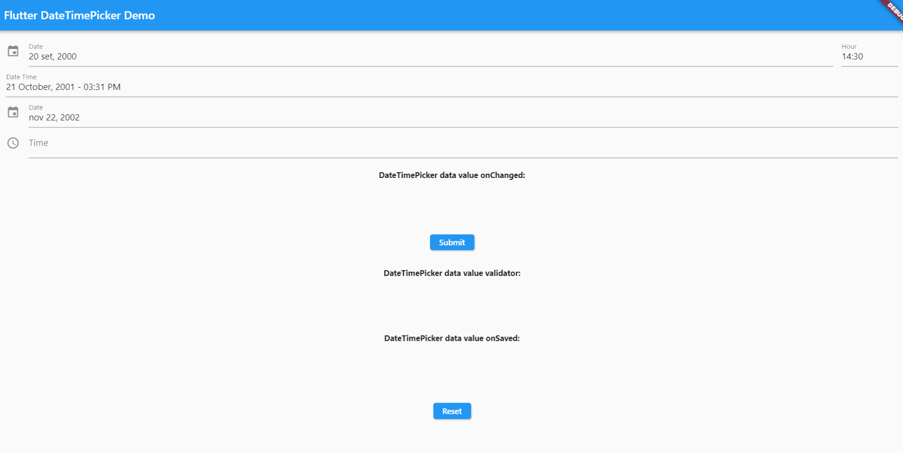

# forms

## contents

- [forms](#forms)
  - [contents](#contents)
  - [introduction](#introduction)
  - [form with single field](#form-with-single-field)
  - [textfield](#textfield)
  - [textformfield](#textformfield)
  - [form example - text and numbers](#form-example---text-and-numbers)
  - [dropdown](#dropdown)
  - [datetime picker](#datetime-picker)
    - [install](#install)
    - [use](#use)
    - [end result](#end-result)

## introduction

flutter forms can have inbuilt validation which is great from the coder and the user point of view

## form with single field

here is a sample [form](../projects/Form03) with just one field, but it does have validation

```java
import 'package:flutter/material.dart';
void main() => runApp(const App());
class App extends StatelessWidget {
  const App({Key? key}): super(key:key);
  @override
  Widget build(BuildContext context){
    return MaterialApp(
      title:'An App',
      home: Scaffold(
        appBar:AppBar(title: const Text('An App')),
        body: const Home(),
      ),
    );
  }
}

class Home extends StatefulWidget{
  const Home({Key? key}):super(key:key);
  @override
  State<Home> createState() => HomeState();
}

class HomeState extends State<Home>{
  final GlobalKey<FormState> _key = GlobalKey<FormState>();
  @override
  Widget build(BuildContext context){
    String validateEmail(String? value) {
      String pattern =
          r"^[a-zA-Z0-9.!#$%&'*+/=?^_`{|}~-]+@[a-zA-Z0-9](?:[a-zA-Z0-9-]"
          r"{0,253}[a-zA-Z0-9])?(?:\.[a-zA-Z0-9](?:[a-zA-Z0-9-]"
          r"{0,253}[a-zA-Z0-9])?)*$";
      RegExp regex = RegExp(pattern);
      if (value == null || value.isEmpty || !regex.hasMatch(value))
        return 'Enter a valid email address';
      else
        return null;
    }
    return Center(
      child: Column(
        mainAxisAlignment: MainAxisAlignment.center,
        children: <Widget>[
          const Text('This is a form'),
          IconButton(
            icon: const Icon(Icons.add_alert),
            onPressed: () => print('pressed'),
          ),
          Form(
            key: _key,
            autovalidateMode: AutovalidateMode.always,
            child: Column(
              crossAxisAlignment: CrossAxisAlignment.start,
              children: <Widget>[
                TextFormField(
                  decoration: const InputDecoration(
                    hintText: 'Email Basic Validation'
                  ),
                  validator: (String? value){
                    if (value == null || value.isEmpty){
                      return 'mandatory field';
                    }
                    return null;
                  },
                ),
                TextFormField(
                  decoration: const InputDecoration(
                    hintText: 'Email Advanced Validation'
                  ),
                  validator: (value) => validateEmail(value),
                ),
                Padding(
                  padding: const EdgeInsets.symmetric(vertical: 16.0),
                  child: ElevatedButton(
                    onPressed: () => {
                      if(_key.currentState!.validate()){
                        print('submit')
                      } else {
                        print('dont submit')
                      }
                    },
                    child: const Text('Submit'),
                  ),
                ),
              ]
            ),
          ),
        ],
      )
    );
  }
}
```


## textfield

see [TextField01](../projects/TextField01)

```java
TextField(
  decoration: const InputDecoration(
    border: OutlineInputBorder(),
    hintText: 'Enter some text here'
  ),
  onChanged: (text) => print('You entered text $text'),
),
```

for a combination of a text input field which updates a label see [TextField02](../projects/TextField02)

```java
String _inputText = '';
void _updateTextLabel(inputText) {
  setState(() {
    _inputText = inputText;
  });
  print('text field has been updated to $_inputText');
}
TextField(
  decoration: const InputDecoration(
        border: OutlineInputBorder(),
        hintText: 'Enter some text here'),
  onChanged: (inputText) => {
    _updateTextLabel(inputText)
  }
),
const Text(
  'This is a text field',
),
Text(
  _inputText,
),
```

## textformfield

these fields are required when the form is going to be validated, otherwise just use simple [textfield](#textfield)

When we display the form, sometimes we wish to display the index field as well as a read-only field but also colour it slightly to indicate clearly to the user that it's a different kind of field so if they do click on it to change it, they can understand clearly that it's a read only field

```java
Container(
  width: 500,
  child: TextFormField(
    enabled: false,
    initialValue: album.id.toString(),
    decoration: const InputDecoration(
      fillColor: Color(0xffb5e6e1),
      filled: true,
      border: OutlineInputBorder(),
      hintText: 'album id'
    ),
  ),
),
```

## form example - text and numbers

here is a complete form example taken from [Form04](../projects/Form04) 

```java
import 'package:flutter/material.dart';
import 'package:flutter/services.dart';
void main() => runApp(const App());
class App extends StatelessWidget {
  const App({Key? key}): super(key:key);
  @override
  Widget build(BuildContext context){
    return MaterialApp(
      title:'An App',
      home: Scaffold(
        appBar:AppBar(title: const Text('An App')),
        body: const Home(),
      ),
    );
  }
}

class Home extends StatefulWidget{
  const Home({Key? key}):super(key:key);
  @override
  State<Home> createState() => HomeState();
}

class HomeState extends State<Home>{
  final GlobalKey<FormState> _key = GlobalKey<FormState>();
  TextEditingController _controller01 = TextEditingController();
  TextEditingController _controller02 = TextEditingController();
  TextEditingController _textFieldController = TextEditingController();

  int _counter01 = 3;
  int _counter02 = 3;

  @override
  void initState(){
    super.initState();
    _controller01.text = _counter01.toString();
    _controller02.text = _counter02.toString();
    _textFieldController.text = 'some text';
  }

  void incrementCounter01(){
    setState(() => {
      _counter01 = ((_counter01 += 3) ~/ 3) * 3
    });
    setState(() => {
      _controller01.text = _counter01.toString()
    });
  }

  void decrementCounter01(){
    setState(() => {
      _counter01 = ((_counter01 -= 3) ~/ 3) * 3
    });
    setState(() => {
      _controller01.text = _counter01.toString()
    });
  }

  void incrementCounter02(){
    setState(() => {
      _counter02 = ((_counter02 += 3) ~/ 3) * 3
    });
    setState(() => {
     _controller02.text = _counter02.toString()
    });
  }

  void decrementCounter02(){
    setState(() => {
      _counter02 = ((_counter02 -= 3) ~/ 3) * 3
    });
    setState(() => {
      _controller02.text = _counter02.toString()
    });
  }

  String? validateEmail(String? value) {
    String pattern =
        r"^[a-zA-Z0-9.!#$%&'*+/=?^_`{|}~-]+@[a-zA-Z0-9](?:[a-zA-Z0-9-]"
        r"{0,253}[a-zA-Z0-9])?(?:\.[a-zA-Z0-9](?:[a-zA-Z0-9-]"
        r"{0,253}[a-zA-Z0-9])?)*$";
    RegExp regex = RegExp(pattern);
    if (value == null || value.isEmpty || !regex.hasMatch(value))
      return 'Enter a valid email address';
    else
      return null;
  }

  String? validateNumber(String? value){
    if (value == null)
      return null;
    else if (int.parse(value) <= 0)
      return 'Enter a positive non-zero number';
    else if (int.parse(value) > 99)
      return 'Number must be less than 100';
    else
      return null;
  }

  validateForSubmission(){
    if(_key.currentState!.validate()){
      print('submit ${(_counter01 + _counter02).toString()}');
    } else {
      print('dont submit');
    }
  }

  @override
  Widget build(BuildContext context){
    return Column(
      mainAxisAlignment: MainAxisAlignment.center,
      children: <Widget>[
        const Text('This is a form'),
        IconButton(
          icon: const Icon(Icons.add_alert),
          onPressed: () => print('pressed'),
        ),
        Form(
          autovalidateMode: AutovalidateMode.disabled,
          key: _key,
          child: Column(
            crossAxisAlignment: CrossAxisAlignment.center,
            mainAxisAlignment: MainAxisAlignment.start,
            mainAxisSize: MainAxisSize.min,
            children: <Widget>[
              TextField(
                controller: _textFieldController,
                inputFormatters: [
                  FilteringTextInputFormatter(RegExp(r'[a-zA-Z]'), allow: true)
                ],
                decoration: InputDecoration(
                    labelText: 'name (letters a-z)',
                    helperText: 'Only accept letters from a to z',
                    border: OutlineInputBorder(
                        borderRadius: BorderRadius.circular(50))
                ),
              ),
              TextFormField(
                initialValue: 'some content',
                decoration: const InputDecoration(
                  hintText: 'field must have any content present',
                  labelText: 'field must have any content present',
                ),
                validator: (String? value){
                  if (value == null || value.isEmpty){
                    return 'mandatory field';
                  }
                  return null;
                },
              ),
              TextFormField(
                initialValue: '123@email.com',
                decoration: const InputDecoration(
                  hintText: 'Email'
                ),
                validator: (value) => validateEmail(value),
              ),
              Row(
                mainAxisAlignment: MainAxisAlignment.center,
                children: <Widget>[
                  SizedBox(
                    width: 200,
                    child: TextFormField(
                      controller: _controller01,
                      keyboardType: TextInputType.number,
                      inputFormatters: <TextInputFormatter>[
                        FilteringTextInputFormatter.allow(RegExp(r'[0-9]')),
                      ],
                      decoration: InputDecoration(
                        labelText: "number (step 3)",
                        hintText: "any number (step 3)",
                        icon: Icon(Icons.phone_iphone)
                      ), 
                      validator: (value) => validateNumber(value),
                    ),
                  ),
                  Flexible(
                    child: IconButton(
                      icon: Icon(
                        Icons.add,
                      ),
                      iconSize: 16.0,
                      onPressed: incrementCounter01,
                    ),
                  ),
                  Flexible(
                    child: IconButton(
                      icon: Icon(
                        Icons.remove,
                      ),
                      iconSize: 16.0,
                      onPressed: decrementCounter01,
                    ),  
                  ),
                ]
              ),
              Row(
                mainAxisAlignment: MainAxisAlignment.center,
                children: <Widget>[
                  SizedBox(
                    width: 200,
                    child: TextFormField(
                      controller: _controller02,
                      keyboardType: TextInputType.numberWithOptions(decimal: true,signed: false),
                      inputFormatters: <TextInputFormatter>[
                        FilteringTextInputFormatter.allow(RegExp(r'[0-9]')),
                      ],
                      decoration: const InputDecoration(
                        hintText: 'number (step 3)',
                        labelText: 'number (step 3)',
                      ),
                    ),
                  ),
                  Flexible(
                    child: IconButton(
                      icon: Icon(
                        Icons.add,
                      ),
                      iconSize: 16.0,
                      onPressed: incrementCounter02,
                    ),
                  ),
                  Flexible(
                    child: IconButton(
                      icon: Icon(
                        Icons.remove,
                      ),
                      iconSize: 16.0,
                      onPressed: decrementCounter02,
                    ),  
                  ),
                ]
              ),
              Padding(
                padding: const EdgeInsets.symmetric(vertical: 16.0),
                child: ElevatedButton(
                  onPressed: validateForSubmission,
                  child: const Text('Submit'),
                ),
              ),
            ]
          ),
        ),
      ],
    );
  }
}
```

## dropdown

from Material Design 

see `DropDown01` example

```java
import 'package:flutter/material.dart';
import 'package:flutter_teaching_app/constants.dart';

class DropDown01 extends StatefulWidget {
  const DropDown01({Key? key}) : super(key: key);

  @override
  State<DropDown01> createState() => _DropDown01State();
}

class _DropDown01State extends State<DropDown01> {
  var dropDownValue = kCurrenciesList[0];

  // Data for Bitcoin App

  const List<String> kCurrenciesList = [
    'GBP',
    'USD',
    'CAD',
  ];

  var kCurrenciesDropDownList =
      kCurrenciesList.map<DropdownMenuItem<String>>((String value) {
    return DropdownMenuItem<String>(
      value: value,
      child: Text(value),
    );
  }).toList();

  onDropDownSelected(String newValue) {
    print('new dropdown item has been selected');
    setState(() {
      dropDownValue = newValue;
    });
  }

  @override
  Widget build(BuildContext context) {
    return MaterialApp(
      theme: ThemeData.dark(),
      home: Scaffold(
        appBar: AppBar(
          title: const Center(
            child: Text('Drop Down Box'),
          ),
        ),
        body: Column(
          children: [
            Expanded(
              flex: 1,
              child: Center(
                child: DropdownButton<String>(
                  value: dropDownValue,
                  items: kCurrenciesDropDownList,
                  onChanged: (String? newValue) {
                    var value = newValue ?? '';
                    onDropDownSelected(value);
                  },
                ),
              ),
            ),
          ],
        ),
      ),
    );
  }
}
```


## datetime picker



[DateTimePicker01](../projects/DateTimePicker01)

to add datetime picker we can use native code.  however in this example I have imported a library to save a whole load of work!

### install

```java
flutter pub add date_time_picker
/*
dependencies:
  date_time_picker: ^2.1.0
*/
```

### use

```java
import 'package:date_time_picker/date_time_picker.dart';
```

### end result

```java
import 'package:date_time_picker/date_time_picker.dart';
import 'package:flutter/material.dart';
import 'package:flutter_localizations/flutter_localizations.dart';
import 'package:intl/intl.dart';

void main() => runApp(MyApp());

class MyApp extends StatelessWidget {
  @override
  Widget build(BuildContext context) {
    return MaterialApp(
      title: 'Flutter DateTimePicker Demo',
      home: MyHomePage(),
      localizationsDelegates: [
        GlobalWidgetsLocalizations.delegate,
        GlobalMaterialLocalizations.delegate,
        GlobalCupertinoLocalizations.delegate,
      ],
      supportedLocales: [Locale('en', 'US')], //, Locale('pt', 'BR')],
    );
  }
}

class MyHomePage extends StatefulWidget {
  MyHomePage({Key? key}) : super(key: key);

  @override
  _MyHomePageState createState() => _MyHomePageState();
}

class _MyHomePageState extends State<MyHomePage> {
  GlobalKey<FormState> _oFormKey = GlobalKey<FormState>();
  late TextEditingController _controller1;
  late TextEditingController _controller2;
  late TextEditingController _controller3;
  late TextEditingController _controller4;

  //String _initialValue = '';
  String _valueChanged1 = '';
  String _valueToValidate1 = '';
  String _valueSaved1 = '';
  String _valueChanged2 = '';
  String _valueToValidate2 = '';
  String _valueSaved2 = '';
  String _valueChanged3 = '';
  String _valueToValidate3 = '';
  String _valueSaved3 = '';
  String _valueChanged4 = '';
  String _valueToValidate4 = '';
  String _valueSaved4 = '';

  @override
  void initState() {
    super.initState();
    Intl.defaultLocale = 'pt_BR';
    //_initialValue = DateTime.now().toString();
    _controller1 = TextEditingController(text: DateTime.now().toString());
    _controller2 = TextEditingController(text: DateTime.now().toString());
    _controller3 = TextEditingController(text: DateTime.now().toString());

    String lsHour = TimeOfDay.now().hour.toString().padLeft(2, '0');
    String lsMinute = TimeOfDay.now().minute.toString().padLeft(2, '0');
    _controller4 = TextEditingController(text: '$lsHour:$lsMinute');

    _getValue();
  }

  /// This implementation is just to simulate a load data behavior
  /// from a data base sqlite or from a API
  Future<void> _getValue() async {
    await Future.delayed(const Duration(seconds: 3), () {
      setState(() {
        //_initialValue = '2000-10-22 14:30';
        _controller1.text = '2000-09-20 14:30';
        _controller2.text = '2001-10-21 15:31';
        _controller3.text = '2002-11-22';
        _controller4.text = '17:01';
      });
    });
  }

  @override
  Widget build(BuildContext context) {
    return Scaffold(
      appBar: AppBar(
        title: Text('Flutter DateTimePicker Demo'),
      ),
      body: SingleChildScrollView(
        padding: EdgeInsets.only(left: 20, right: 20, top: 10),
        child: Form(
          key: _oFormKey,
          child: Column(
            children: <Widget>[
              Text('Use Various Methods To Select A Date And A Time'),
              DateTimePicker(
                type: DateTimePickerType.dateTimeSeparate,
                dateMask: 'd MMM, yyyy',
                controller: _controller1,
                //initialValue: _initialValue,
                firstDate: DateTime(2000),
                lastDate: DateTime(2100),
                icon: Icon(Icons.event),
                dateLabelText: 'Date',
                timeLabelText: "Hour",
                //use24HourFormat: false,
                //locale: Locale('pt', 'BR'),
                selectableDayPredicate: (date) {
                  if (date.weekday == 6 || date.weekday == 7) {
                    return false;
                  }
                  return true;
                },
                onChanged: (val) => setState(() => _valueChanged1 = val),
                validator: (val) {
                  setState(() => _valueToValidate1 = val ?? '');
                  return null;
                },
                onSaved: (val) => setState(() => _valueSaved1 = val ?? ''),
              ),
              DateTimePicker(
                type: DateTimePickerType.dateTime,
                dateMask: 'd MMMM, yyyy - hh:mm a',
                controller: _controller2,
                //initialValue: _initialValue,
                firstDate: DateTime(2000),
                lastDate: DateTime(2100),
                //icon: Icon(Icons.event),
                dateLabelText: 'Date Time',
                use24HourFormat: false,
                locale: Locale('en', 'US'),
                onChanged: (val) => setState(() => _valueChanged2 = val),
                validator: (val) {
                  setState(() => _valueToValidate2 = val ?? '');
                  return null;
                },
                onSaved: (val) => setState(() => _valueSaved2 = val ?? ''),
              ),
              DateTimePicker(
                type: DateTimePickerType.date,
                //dateMask: 'yyyy/MM/dd',
                controller: _controller3,
                //initialValue: _initialValue,
                firstDate: DateTime(2000),
                lastDate: DateTime(2100),
                icon: Icon(Icons.event),
                dateLabelText: 'Date',
                locale: Locale('pt', 'BR'),
                onChanged: (val) => setState(() => _valueChanged3 = val),
                validator: (val) {
                  setState(() => _valueToValidate3 = val ?? '');
                  return null;
                },
                onSaved: (val) => setState(() => _valueSaved3 = val ?? ''),
              ),
              DateTimePicker(
                type: DateTimePickerType.time,
                //timePickerEntryModeInput: true,
                //controller: _controller4,
                initialValue: '', //_initialValue,
                icon: Icon(Icons.access_time),
                timeLabelText: "Time",
                use24HourFormat: false,
                locale: Locale('pt', 'BR'),
                onChanged: (val) => setState(() => _valueChanged4 = val),
                validator: (val) {
                  setState(() => _valueToValidate4 = val ?? '');
                  return null;
                },
                onSaved: (val) => setState(() => _valueSaved4 = val ?? ''),
              ),
              SizedBox(height: 20),
              Text(
                'DateTimePicker data value onChanged:',
                style: TextStyle(fontWeight: FontWeight.bold),
              ),
              SizedBox(height: 10),
              SelectableText(_valueChanged1),
              SelectableText(_valueChanged2),
              SelectableText(_valueChanged3),
              SelectableText(_valueChanged4),
              SizedBox(height: 10),
              ElevatedButton(
                onPressed: () {
                  final loForm = _oFormKey.currentState;

                  if (loForm?.validate() == true) {
                    loForm?.save();
                  }
                },
                child: Text('Submit'),
              ),
              SizedBox(height: 30),
              Text(
                'DateTimePicker data value validator:',
                style: TextStyle(fontWeight: FontWeight.bold),
              ),
              SizedBox(height: 10),
              SelectableText(_valueToValidate1),
              SelectableText(_valueToValidate2),
              SelectableText(_valueToValidate3),
              SelectableText(_valueToValidate4),
              SizedBox(height: 10),
              Text(
                'DateTimePicker data value onSaved:',
                style: TextStyle(fontWeight: FontWeight.bold),
              ),
              SizedBox(height: 10),
              SelectableText(_valueSaved1),
              SelectableText(_valueSaved2),
              SelectableText(_valueSaved3),
              SelectableText(_valueSaved4),
              SizedBox(height: 20),
              ElevatedButton(
                onPressed: () {
                  final loForm = _oFormKey.currentState;
                  loForm?.reset();

                  setState(() {
                    _valueChanged1 = '';
                    _valueChanged2 = '';
                    _valueChanged3 = '';
                    _valueChanged4 = '';
                    _valueToValidate1 = '';
                    _valueToValidate2 = '';
                    _valueToValidate3 = '';
                    _valueToValidate4 = '';
                    _valueSaved1 = '';
                    _valueSaved2 = '';
                    _valueSaved3 = '';
                    _valueSaved4 = '';
                  });

                  _controller1.clear();
                  _controller2.clear();
                  _controller3.clear();
                  _controller4.clear();
                },
                child: Text('Reset'),
              ),
            ],
          ),
        ),
      ),
    );
  }
}
```