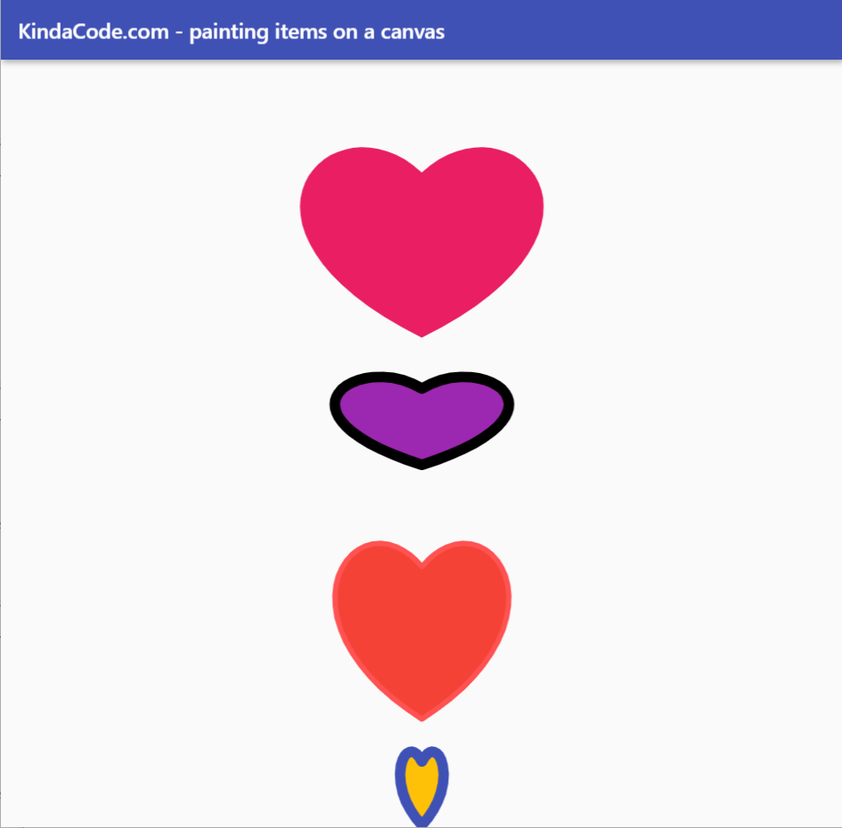

# paint

## contents

- [paint](#paint)
  - [contents](#contents)
  - [introduction](#introduction)
  - [paint01](#paint01)

## introduction

this looks at painting shapes on the screen

## paint01

  

see [Paint01](../projects/Paint01) for this worked example

```java
// main.dart
import 'package:flutter/material.dart';

void main() {
  runApp(const MyApp());
}

class MyApp extends StatelessWidget {
  const MyApp({Key? key}) : super(key: key);
  @override
  Widget build(BuildContext context) {
    return MaterialApp(
      // Hide the debug banner
      debugShowCheckedModeBanner: false,
      title: 'KindaCode.com - painting items on a canvas',
      theme: ThemeData(
        primarySwatch: Colors.indigo,
      ),
      home: const HomeScreen(),
    );
  }
}

// Implementing our heart painter
class MyPainter extends CustomPainter {
  // The color of the heart
  final Color bodyColor;

  // The color of the border of the heart
  final Color borderColor;
  // The thickness of the border
  final double borderWith;

  MyPainter(this.bodyColor, this.borderColor, this.borderWith);

  @override
  void paint(Canvas canvas, Size size) {
    // The body of the heart
    final Paint body = Paint();
    body
      ..color = bodyColor
      ..style = PaintingStyle.fill
      ..strokeWidth = 0;

    // The border of the heart
    final Paint border = Paint();
    border
      ..color = borderColor
      ..style = PaintingStyle.stroke
      ..strokeCap = StrokeCap.round
      ..strokeWidth = borderWith;

    final double width = size.width;
    final double height = size.height;

    final Path path = Path();
    path.moveTo(0.5 * width, height * 0.4);
    path.cubicTo(0.2 * width, height * 0.1, -0.25 * width, height * 0.6,
        0.5 * width, height);
    path.moveTo(0.5 * width, height * 0.4);
    path.cubicTo(0.8 * width, height * 0.1, 1.25 * width, height * 0.6,
        0.5 * width, height);

    canvas.drawPath(path, body);
    canvas.drawPath(path, border);
  }

  @override
  bool shouldRepaint(CustomPainter oldDelegate) {
    return true;
  }
}

class HomeScreen extends StatefulWidget {
  const HomeScreen({Key? key}) : super(key: key);

  @override
  State<HomeScreen> createState() => _HomeScreenState();
}

class _HomeScreenState extends State<HomeScreen> {
  @override
  Widget build(BuildContext context) {
    return Scaffold(
      appBar: AppBar(
        title: const Text('KindaCode.com - painting items on a canvas'),
      ),
      body: Center(
          child: Column(
        mainAxisAlignment: MainAxisAlignment.spaceAround,
        mainAxisSize: MainAxisSize.min,
        children: [
          // Non-border heart
          CustomPaint(
            size: const Size(280, 260),
            painter: MyPainter(Colors.pink, Colors.transparent, 0),
          ),

          // Hearts with borders
          CustomPaint(
            size: const Size(200, 120),
            painter: MyPainter(Colors.purple, Colors.black, 10),
          ),
          CustomPaint(
            size: const Size(200, 240),
            painter: MyPainter(Colors.red, Colors.redAccent, 5),
          ),
          CustomPaint(
            size: const Size(50, 100),
            painter: MyPainter(Colors.amber, Colors.indigo, 10),
          ),
        ],
      )),
    );
  }
}
```