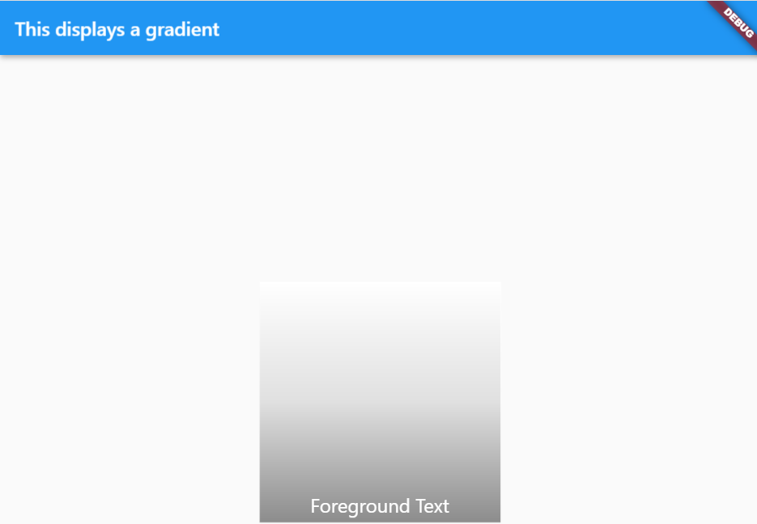

# styling

## contents

- [styling](#styling)
  - [contents](#contents)
  - [introduction](#introduction)
  - [finding components](#finding-components)
  - [material design](#material-design)
  - [justifying](#justifying)
    - [center justify](#center-justify)
  - [margin](#margin)
    - [margin all](#margin-all)
    - [margin vertical](#margin-vertical)
    - [margin horizontal](#margin-horizontal)
  - [padding](#padding)
  - [color](#color)
  - [height](#height)
  - [font](#font)
  - [background color](#background-color)
    - [container styling](#container-styling)
    - [container color](#container-color)
    - [card styling](#card-styling)
    - [styling a ListTile](#styling-a-listtile)
  - [Text Styling](#text-styling)
    - [font size pixels](#font-size-pixels)
    - [font size em](#font-size-em)
    - [font size to fit into given space](#font-size-to-fit-into-given-space)
    - [max lines with ellipsis overflow](#max-lines-with-ellipsis-overflow)
    - [font colour](#font-colour)
    - [font weight eg bold](#font-weight-eg-bold)
    - [italic](#italic)
    - [font family](#font-family)
    - [fonts downloadable](#fonts-downloadable)
    - [opacity](#opacity)
    - [container text styling](#container-text-styling)
  - [decoration](#decoration)
    - [line height](#line-height)
    - [underline](#underline)
    - [rich text with text span](#rich-text-with-text-span)
    - [painting text](#painting-text)
  - [shadow](#shadow)
    - [button with shadow](#button-with-shadow)
  - [default text style](#default-text-style)
  - [theme](#theme)
    - [textTheme](#texttheme)
    - [color foreground and background](#color-foreground-and-background)
    - [theme font family](#theme-font-family)
  - [gradient](#gradient)
    - [gradient01](#gradient01)
  - [tooltip](#tooltip)
  - [constrained box](#constrained-box)
  - [media query](#media-query)
  - [grid styling](#grid-styling)
  - [stacking items](#stacking-items)


## introduction

this section involves basic styling of basic widgets including

- center
- style
- margin
- padding
- theme
- [animation](animation.md)


## finding components

When unit testing it is important to be able to find and identify items on the screen.  we can do this most simply by text

see [unit testing - finding a clickable widget by text](#finding-a-clickable-widget-by-text) in order to be able to undertand this.

## material design

flutter apps can be styled with [material design](https://material.io) or without.

with 

```java
import 'package:flutter/material.dart';

void main() {
  runApp(const MaterialApp());
}
```

without

```java
import 'package:flutter/material.dart';
void main() {
  runApp(
    const Center(
      child: Text(
        'Hello, world!',
        textDirection: TextDirection.ltr,
      ),
    ),
  );
}
```

## justifying

### center justify

```java
class Home extends StatelessWidget {
  @override
  Widget build (BuildContext context) {
    return Scaffold(
      appBar: AppBar(
        title: Center(
          child: Text("Home Screen")),
      ),
      body: Text('some text')
    );
  }
}
```


## margin

### margin all 

```java
Container(
  margin: const EdgeInsets.all(20),
  child: Text('some text'),
),
```

### margin vertical

```java
margin: EdgeInsets.symmetric(vertical:10.0),
```

### margin horizontal

```java
Container(
  margin: const EdgeInsets.only(right:10.0),
  child: Text('some text'),
),
```


## padding

```java
padding: const EdgeInsets.all(30),
padding: const EdgeInsets.fromLTRB(0,10,0,10),
padding: const EdgeInsets.only(left: 20, right: 20, top: 10),
padding: const EdgeInsets.symmetric(vertical: 16.0),
padding: const EdgeInsets.symmetric(horizontal: 8.0),
```


## color

material design colors https://material.io/design/color/the-color-system.html#tools-for-picking-colors

```java
color: Colors.red,
// material design https://material.io/design/color/the-color-system.html#tools-for-picking-colors
color: Colors.cyan[600]),
// ARGB (Alpha Red Green Blue)
color: Color(0xffaabbcc),
// RGBO (Red Green Blue Opacity)
color: Color.fromRGBO(100,100,100,1.0)
```

## height

```java
height: 50,
```

## font 

```java
textStyle: const TextStyle(fontSize:24),
```

## background color

```java
child: Text('an app',
  style: TextStyle(
    backgroundColor: Colors.white,
  )
),
```

### container styling

to see the next three styling examples in a worked example, see [Styling01](../projects/Styling01)

```java
Container(
  height: 50,
  color: Colors.amber,
  margin: const EdgeInsets.symmetric(vertical: 5.0),
  child: const Center(child: Text('List View Container')),
),
```

### container color

```java
Center(
  child: Container(
    color: Colors.amber,
    // or
    decoration: BoxDecoration(color: const Color(0xFF9adaed)),
  )
),
```

### card styling

```java
const Card(
  child: ListTile(title: Text('List View - Card + ListTile 1')),
  margin: const EdgeInsets.symmetric(vertical: 5.0),
  color: const Color(0xFF9adaed),
),
```

### styling a ListTile

```java
Center(
  child: Container(
    decoration: BoxDecoration(color: const Color(0xFF9adaed)),
    margin: const EdgeInsets.symmetric(vertical: 5.0),
    child: ListTile(
      title: const Center(
        child: Text('List View - Card + ListTile 5'),
      ),
    ),
  )
),
```


## Text Styling

to see a styling example, see [Styling01](../projects/Styling01)

### font size pixels

```java
Text("BUTTON 2",
  style: new TextStyle(
    fontSize:12.0,
    color: const Color(0xFF000000),
    fontWeight: FontWeight.w200,
    fontFamily: "Roboto"
  ),
)
```

### font size em

*not working*

```java
Text(
  "These are wise words, enterprising men quote 'em.",
  style: DefaultTextStyle.of(context).style.apply(fontSizeFactor: 2.0),
)
```

### font size to fit into given space

```java
https://pub.dev/packages/auto_size_text
AutoSizeText(
  'The text to display',
  style: TextStyle(fontSize: 20),
  maxLines: 2,
)
```

### max lines with ellipsis overflow

```java
AutoSizeText(
  'A really long String',
  style: TextStyle(fontSize: 30),
  minFontSize: 18,
  maxLines: 4,
  overflow: TextOverflow.ellipsis,
)
```

### font colour

```java
Text("BUTTON 2",
  style: new TextStyle(
    fontSize:12.0,
    color: const Color(0xFF000000),
    fontWeight: FontWeight.w200,
    fontFamily: "Roboto"
  ),
)
```

### font weight eg bold

```java
Text("BUTTON 2",
  style: new TextStyle(
    fontSize:12.0,
    color: const Color(0xFF000000),
    fontWeight: FontWeight.w200,
    fontFamily: "Roboto"
  ),
)
```

```java
child: Text(
  'footer', 
  style: TextStyle(
    fontWeight: FontWeight.bold
  ),
),
```

### italic

```java
Container(
  child: Text(
    'single api record',
    style: TextStyle(
      fontSize: 15, 
      fontWeight: FontWeight.bold, 
      fontStyle: FontStyle.italic, 
      decoration: TextDecoration.underline),
  ),                
),
```

### font family

```java
Text("BUTTON 2",
  style: new TextStyle(
    fontSize:12.0,
    color: const Color(0xFF000000),
    fontWeight: FontWeight.w200,
    fontFamily: "Roboto"
  ),
)
```

### fonts downloadable

download the font eg `fonts\Pacifico-Regular.ttf`

add to `pubspec.yaml`

```yaml
flutter:
  uses-material-design: true
  fonts:
  - family: Pacifico
    fonts:
      - asset: fonts/Pacifico-Regular.ttf
```

and use as

```java
Text(
  'Phil Anderson',
  style: TextStyle(
    fontSize: 40,
    fontWeight: FontWeight.bold,
    fontFamily: "Pacifico",
  ),
```


### opacity

```java
style: TextStyle(color: Colors.black.withOpacity(0.3)),
```

### container text styling

```java
Container(
  padding: EdgeInsets.fromLTRB(0,10,0,10),
  child: Text(
    'single api record',
    style: TextStyle(
      fontSize: 15, 
      fontWeight: FontWeight.bold, 
      fontStyle: FontStyle.italic, 
      decoration: TextDecoration.underline),
  ),                
),
```

## decoration

decoration can add effects to components such as

- borderRadius
- gradient
  - linear

different decorations exist such as

- BoxDecoration


```java
Tooltip(
  message: 'This is some help text to understand what to do ',
  child: const Text('This is some text without much explanation'),
  waitDuration: const Duration(seconds: 1),
  showDuration: const Duration(seconds: 4),
  height: 50,
  textStyle: const TextStyle(fontSize:24),
  padding: const EdgeInsets.all(8.0),
  decoration: BoxDecoration(
    borderRadius: BorderRadius.circular(15),
    gradient: const LinearGradient(colors: <Color>[Colors.amber, Colors.red]),
  ),
),
```

### line height

```java
const Text(
  'text',
  style: const TextStyle(
    height: 40,
  ),
)
```

### underline

```java
style: const TextStyle(
  color: Colors.black,
  decoration: TextDecoration.underline,
  decorationColor: Colors.red,
  decorationStyle: TextDecorationStyle.wavy,
),
```

### rich text with text span

allows manipulation of particular words 

```java
RichText(
  text: TextSpan(
    text: 'Hello ',
    style: DefaultTextStyle.of(context).style,
    children: const <TextSpan>[
      TextSpan(text: 'bold', style: TextStyle(fontWeight: FontWeight.bold)),
      TextSpan(text: ' world!'),
    ],
  ),
)
```

### painting text

```java
Text(
  'Paint() fill',
  style: TextStyle(
    fontSize: 100,
    foreground: Paint()
    ..style = PaintingStyle.fill
    ..color = Colors.blue[700]!,
  ),
),
Stack(
  children: <Widget>[
    Text(
      'Paint() stroke outline - not working as expected',
      style: TextStyle(
        fontSize: 100,
        foreground: Paint()
        ..style = PaintingStyle.stroke
        ..strokeWidth = 50
        ..color = Colors.black,
      ),
    ),
    Text(
      'Paint() stroke outline - not working as expected',
      style: TextStyle(
        fontSize: 100,
        color: Colors.grey[300],
      ),
    ),
  ],
),
Stack(
  children: <Widget>[
    Text(
      'hello artistic text',
      style: TextStyle(
        fontSize: 100,
        foreground: Paint()
        ..style = PaintingStyle.stroke
        ..strokeWidth = 25
        ..color = Colors.blue[700]!,
        background: Paint()
        ..style = PaintingStyle.fill
        ..color = Colors.red[100]!,
      ),
    ),
    Text(
      'hello artistic text',
      style: TextStyle(
        fontSize: 100,
        color: Colors.grey[300],
      ),
    ),
  ],
),
```

## shadow

### button with shadow

*Note : a button cannot have a shadow but must be put in a container which has a shadow*

```java
Container(
  decoration: BoxDecoration(
    boxShadow:[
      BoxShadow(
        color: Colors.grey.withOpacity(0.5),
        spreadRadius: 5,
        blurRadius: 7,
        offset: Offset(0, 3), // changes position of shadow
      ),
    ],
  ),
  child: ElevatedButton(
    autofocus: true,
    clipBehavior: Clip.none,
    onPressed: () => clickButton(),
    color: Colors.blue,
    padding: const EdgeInsets.all(30),
    shape: RoundedRectangleBorder(
      borderRadius: BorderRadius.circular(18.0),
      side: BorderSide(color: Colors.lightBlue),
    ),
    child: Text(buttonText, 
        style: TextStyle(
          color: Colors.white,
          backgroundColor: Colors.blue,
        ),
      ),
  ),
),
```


## default text style

```java
class MyApp extends StatelessWidget {
  @override
  Widget build(BuildContext context) {
    return new MaterialApp(
      theme: new ThemeData(
        primarySwatch: Colors.blue,
      ),
      home: new StatusPage()
    );
  }
}
class StatusPage extends StatelessWidget {
  @override
  Widget build(BuildContext context) {
    TextStyle style = DefaultTextStyle.of(context).style;
    return new Scaffold(
      appBar: new AppBar(),
      body: new DefaultTextStyle(
        style: new TextStyle(
          inherit: true,
          fontSize: 20.0,
          fontWeight: FontWeight.bold,
          decoration: TextDecoration.underline,
          decorationColor: Colors.red,
          decorationStyle: TextDecorationStyle.wavy,
          color: Colors.blue
        ),
        child: new Center(
          child: new Column(
            children: <Widget>[
              new Text("hello"),
            ],
          ),
        )
      )
    );
  }
}
```

```java
return new MaterialApp(
  home: new DefaultTextStyle(
    style: new TextStyle(
      fontWeight: FontWeight.bold,
      decoration: TextDecoration.underline,
      decorationColor: Colors.red,
      decorationStyle: TextDecorationStyle.wavy,
      color: Colors.blue
    ),
    child: new StatusPage()
  ),
);
```

## theme

themes apply global styling across the app, so are very useful to provide a coherency of styling 

### textTheme

Text is applied to a theme which applies to the whole app.

Different themes can be picked out and styled for individual components by choosing child elements of the theme

A list of themes built into flutter can be found here https://api.flutter.dev/flutter/material/TextTheme-class.html

```java
import 'package:flutter/material.dart';
void main() {
  runApp(MyApp());
}
class MyApp extends StatelessWidget {
  @override
  Widget build(BuildContext context) {
    return MaterialApp(
      home: StatefulHome(),
      theme: ThemeData(
        // applies to whole app if applied like this - fontFamily: 'Arial',
        colorScheme: ColorScheme.fromSwatch().copyWith(secondary: Colors.cyan[600]),
        textTheme: TextTheme(
          bodyText1: TextStyle(fontSize: 15),
        ),
      ),
    );
  }
}
class StatefulHome extends StatefulWidget{
  UpdateStatefulHome createState() => UpdateStatefulHome();
}
class UpdateStatefulHome extends State{
  String buttonText = 'some text';
  int counter = 0;
  clickButton(){
    counter++;
    setState( () => {
      if(counter%2==0){
        buttonText = 'Even'
      } else {
        buttonText = 'Odd'
      }
    });
  }
  @override
  Widget build (BuildContext context) {
    return Scaffold(
      appBar: AppBar(
        title: Center(
          child: Text("Home Screen")),
      ),
      body: Container(
        alignment: Alignment.center,
        child: Column(
          children: <Widget>[
            Container(
              child: Text(
                'here is some text',
                style:Theme.of(context).textTheme.bodyText1,
              ),
            ),
            Container(
              child: Text(
                'here is some more text',
                style:Theme.of(context).textTheme.bodyText1,
              ), 
            ),
            Container(
              child: Text('here is a third line'),
            ),
          ],
         )
      ),
    );
  }
}
```

### color foreground and background 

```java
class MyApp extends StatelessWidget {
  final textBackground = Color(0xFFC4F3E0);
  @override
  Widget build(BuildContext context) {
    return MaterialApp(
      home: StatefulHome(),
      theme: ThemeData(
        // applies to whole app if applied like this - fontFamily: 'Arial',
        colorScheme: ColorScheme.fromSwatch().copyWith(secondary: Colors.cyan[600]),
        textTheme: TextTheme(
          bodyText1: TextStyle(
            fontSize: 15,
            backgroundColor: textBackground,
            color: Color(0xFF2C0313),
          ),
        ),
      ),
    );
  }
}
```

### theme font family

```java
class MyApp extends StatelessWidget {
  @override
  Widget build(BuildContext context) {
    return MaterialApp(
      home: StatefulHome(),
      theme: ThemeData(
        fontFamily: 'Georgia',
      ),
    );
  }
}
```

## gradient 

gradient applies a graded colour across the screen
### gradient01

  

[gradient01](../projects/Gradient01)

## tooltip

tooltip is hover text which appears above a component to explain to the user a little more about the component or what action to take

```java
Tooltip(
  message: 'This is some help text to understand what to do ',
  child: const Text('This is some text without much explanation'),
  waitDuration: const Duration(seconds: 1),
  showDuration: const Duration(seconds: 4),
  height: 50,
  textStyle: const TextStyle(fontSize:24),
  padding: const EdgeInsets.all(8.0),
  decoration: BoxDecoration(
    borderRadius: BorderRadius.circular(15),
    gradient: const LinearGradient(colors: <Color>[Colors.amber, Colors.red]),
  ),
),
```


## constrained box

we can apply constraints to set maximum or minimum sizes

see [APIGet04](../projects/APIGet04) for an example of setting minimum card width

```java
child: ConstrainedBox(
  constraints: BoxConstraints(
    minWidth: 300.0
  ),
  child: Card(
    child: Padding(
      padding: EdgeInsets.all(5.0),
      child: Text(output),
    ),
    color: cardColor,                                
  ),
),
```

## media query

to style components as a fractional width of the viewport width or height of the device which is being used, we can use a `media query`.   An example would be in [MediaQuery01](../projects/MediaQuery01)

```java
import 'package:flutter/material.dart';
void main(){
  runApp(MyApp());
}

class MyApp extends StatelessWidget{
  @override
  Widget build(BuildContext context) {
    return MaterialApp( 
      home: Home() 
    );
  }
}

class Home extends StatelessWidget{
  int fraction = 5;
  _printMediaQuery(width, height){
    print('screen width $width height $height of type ${height.runtimeType}');
  }

  @override
  Widget build(BuildContext context) {
     return Scaffold(
          body: Container( 
            width: MediaQuery.of(context).size.width / fraction,
            height: MediaQuery.of(context).size.height / fraction, 
            child: ElevatedButton(
              onPressed: () => _printMediaQuery(MediaQuery.of(context).size.width, MediaQuery.of(context).size.height),
              child: Text('this button is a fraction 1/$fraction of the screen size height and width'),
            ),
          )
       );
  }
}
```

## grid styling

see [GridTile01](../projects/GridTile01) for an example of styling a `GridTile` in a `GridView` with padding and centering of content, and also floating content above an image

```java
import 'package:flutter/material.dart';
void main() {
  runApp(const MyApp());
}
class MyApp extends StatelessWidget {
  const MyApp({Key? key}) : super(key: key);
  @override
  Widget build(BuildContext context) {
    const title = 'Grid List (GridView04 - adding GridTiles to the GridView)';
    return MaterialApp(
      title: title,
      home: Scaffold(
        appBar: AppBar(
          title: const Text(title),
        ),
        body: Container(
          margin: EdgeInsets.all(10),
          child: GridView.count(
            crossAxisCount: 10,
            mainAxisSpacing: 5,
            crossAxisSpacing: 5,
            children: List.generate(20, (index) {
              return Center(
                  child: GridTile(
                  header: Container(
                    padding: const EdgeInsets.all(8),
                    child: Column(
                      mainAxisAlignment: MainAxisAlignment.center,
                      children: <Widget>[
                        const Text('a header'),
                        const Text('extra description'),
                      ],
                    ),
                  ),
                  child: Image(
                    image: NetworkImage('https://picsum.photos/120?random=$index'),
                    fit: BoxFit.cover,
                  ),
                  footer: Container(
                    padding: const EdgeInsets.all(8),
                    child: Text('a footer'),
                  ),
                ),
              );
            }),
          ),
        ),
      ),
    );
  }
}
```

## stacking items

using the `stack` we can stack items on top of each other.  items painted first are overwritten by items painted afterwards so the items should be placed in the stack in order of increasing z-index

```java
import 'package:flutter/material.dart';
void main() => runApp(const App());
class App extends StatelessWidget {
  const App({Key? key}): super(key:key);
  @override
  Widget build(BuildContext context){
    return MaterialApp(
      title:'This stacks 3 containers on top of each other',
      home: Center(
        child: Stack(
          children: <Widget>[
            Container(
              width: 200,
              height: 200,
              color: Colors.red,
            ),
            Container(
              width: 180,
              height: 180,
              color: Colors.green,
            ),
            Container(
              width: 160,
              height: 160,
              color: Colors.blue,
            ),
          ],
        )
      ),
    );
  }
}
```